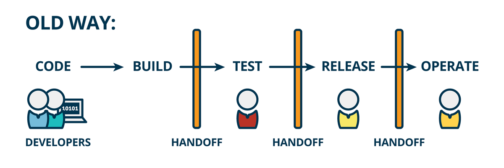
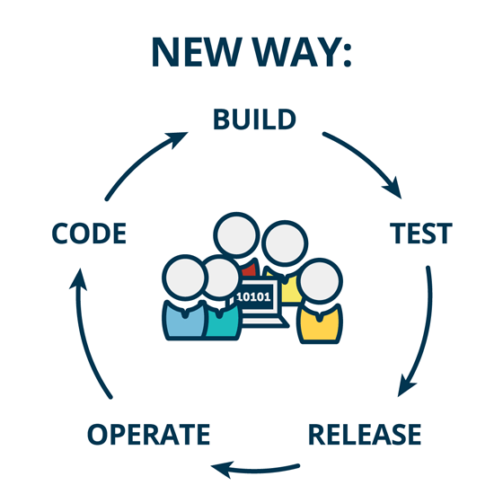
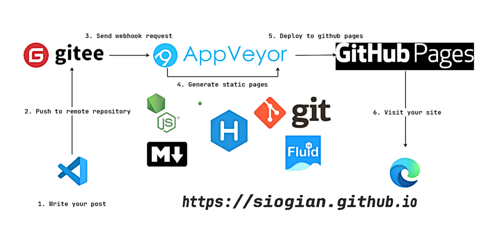

# <!--fit--> DevOps 之 Hexo 自动化部署实践

https://github.com/yhatt/marp-cli-example

<!-- This is presenter note. You can write down notes through HTML comment. -->

---

---

---

---

##### <!--fit--> [Hexo](https://hexo.io) + [GitHub Pages](https://github.com/pages) | [AppVeyor](https://www.appveyor.com) | [Gitee](https://gitee.com)

##### <!--fit--> 👉 免费、快速、方便的 Hexo 自动化部署解决方案

---

---

时间已经快到了
此时的我需要掏出手机
将准备好的结束语提交到Gitee上
这可能与我的网速有一些关系，请大家稍等

---

让我们看一下这个过程究竟发生了什么

1. [Gitee sends a webhook to appveyor](./WebHooks.html)
2. [appveyor fetch appveyor.yml](./yml.html)
3. [appveyor build and deploy to github pages](./build.html)
4. [github pages redeploy](./build.html)

---
### <!--fit--> :ok_hand:

---

### Created by Liang Xiaojian ([@siogian](https://github.com/siogian))

https://github.com/yhatt/marp-cli-example
